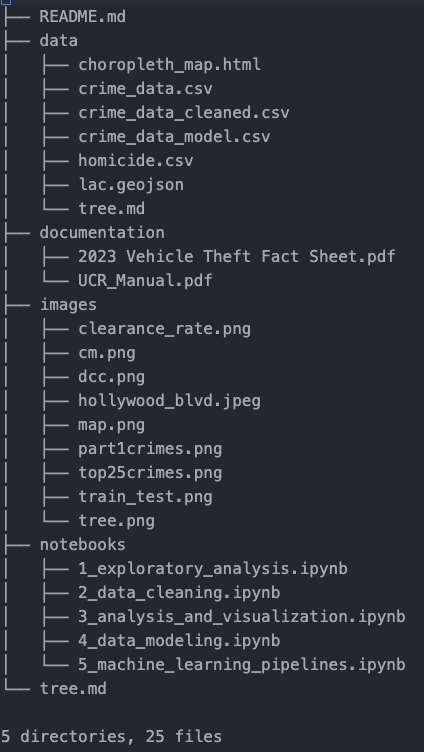

# Los Angeles Crime Analysis

*Photo: Hollywood Blvd - [Downloaded from visittheusa.com](https://www.visittheusa.com/destination/los-angeles)*

For a technical overview, please refer to the [Notebooks Section](https://github.com/DanHerman212/los_angeles_crime/tree/main/notebooks)

# Introduction
The goal for this project was to analyze Los Angeles crime, relative to the national crime index.  The data came direct from the LAPD open data portal.  The project took 2 weeks to complete.

If you would like to read the non-technical analysis, please use the following link on [Medium](https://medium.com/@danherman64/los-angeles-crime-can-law-enforcement-use-ai-to-improve-arrest-outcomes-82c1e0bb6a7e)

## Python Packages

The following Python packages are required to run the code in this repository:

## Common Packages
- `pandas` Data Manipulation
- `numpy` Numerical Computations
- `matplotlib` Data Visualization
- `seaborn` Data Visualization

## Data Visualization
- `folium` Interactive Maps

## Machine Learning Packages
- `scikit-learn` Machine learning library, including preprocessing, model selection, and evaluation
- `nltk` Natural Language Processing
- `xgboost` Gradient Boosted Decision Trees Model
- `fast_ml` Machine Learning Tools

## I/O
- `urllib` URL Handling
- `json` JSON Handling

## File Structure

The data files are too large to host on GitHub. You can access the data file directly through this direct download link:  [LA Crime Activity](https://data.lacity.org/api/views/2nrs-mtv8/rows.csv?accessType=DOWNLOAD) total size is 238mb.

If you're interested in looking at any of the CSV files, please send me an email and I will provide you with a download link.

dan.herman@me.com

